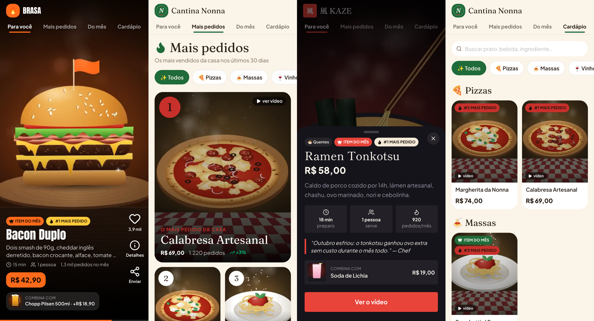

# Cardápio em Vídeo (MVP)

Cardápio digital estilo TikTok: o cliente aproxima o celular da mesa (NFC) ou lê o QR Code e rola os pratos em vídeo vertical. Esta versão só mostra o cardápio: não tem comanda, pedido nem integração com o caixa.



## Rotas

| Rota | O que é |
|---|---|
| `/cardapio` | Página de vendas do produto: demo interativa, restaurantes de exemplo, recursos e planos |
| `/cardapio/<slug>` | O cardápio do cliente. É o link gravado na etiqueta NFC e no QR Code |
| `/cardapio/<slug>/painel` | Painel do restaurante: métricas, logo e cores com prévia ao vivo, itens do mês e placas para imprimir |

Restaurantes de exemplo (fictícios): `brasa-burger`, `kaze-sushi`, `cantina-nonna`.

## Abas do cardápio

- **Para você**: feed vertical em vídeo. Deslizar, dois toques para curtir, detalhes, compartilhar e “Combina com” (sugere a bebida ou o acompanhamento).
- **Mais pedidos**: ranking dos itens mais vendidos no mês, com pódio em vídeo, barras e crescimento. Filtra por categoria.
- **Do mês**: itens escolhidos pelo restaurante, com coroa e nota do chef. Também sobem para o topo do feed.
- **Cardápio**: grade com todos os itens, por categoria e com busca.

## Um sistema para todos os restaurantes

O código é o mesmo para todos. Cada restaurante novo é só:

```
lib/cardapio/restaurantes/<slug>.ts     dados: nome, marca (cores, fonte, logo), categorias e itens
public/midia/<slug>/logo.png            logo (opcional)
public/midia/<slug>/videos/*.mp4|webm   vídeos dos pratos
public/midia/<slug>/posters/*.jpg       capa de cada vídeo
```

### Passo a passo para colocar um restaurante novo

1. **Grave os vídeos** no celular, em pé, de 6 a 15 segundos por prato. Dê a cada arquivo o nome do prato (ex.: `Bacon Duplo.mov`).
2. **Prepare os vídeos** (corta em 9:16, comprime, tira o áudio e gera as capas):
   ```bash
   python scripts/cardapio/preparar_videos.py pizzaria-do-ze ~/videos-ze --logo ~/logo-ze.png
   ```
   O script imprime os itens prontos para colar no arquivo do restaurante.
3. **Crie o arquivo do restaurante**: copie `lib/cardapio/restaurantes/_modelo.ts` para `pizzaria-do-ze.ts`, cole os itens e preencha preço, descrição, categoria, cores e fonte.
4. **Registre** o restaurante em `lib/cardapio/restaurantes/index.ts` (um import e um item na lista).
5. **Publique.** O cardápio fica em `/cardapio/pizzaria-do-ze`. Imprima as placas pelo painel e grave o mesmo link nas etiquetas NFC.

### O que muda de um restaurante para outro

- **Logo**: imagem em `branding.logo`; sem imagem, usa a sigla/emoji de `logoMark`.
- **Cores**: principal, texto no botão, destaque, fundo, cartões, texto e texto suave.
- **Fonte dos títulos**: anton, fraunces, shippori, bricolage, playfair ou jakarta.
- **Arredondamento** dos cartões e botões, nome no topo e frase da tela de abertura.
- **Itens**, categorias, preços, vídeos, “Combina com” e itens do mês.

No painel dá para testar logo, cores e fontes com prévia ao vivo antes de colocar no arquivo. Nesta versão, “Publicar” salva só no navegador; em produção isso vira um banco de dados.

## “Mais pedidos”

O ranking usa `pedidos30d` e `pedidosMesAnterior` de cada item: as vendas do mês tiradas do relatório do caixa do restaurante. Atualize uma vez por mês (ou integre com o sistema de caixa no futuro).

## Vídeos de demonstração

Os 20 vídeos dos restaurantes de exemplo são animações geradas por código (Cairo + ffmpeg):

```bash
pip install pycairo numpy
python scripts/cardapio/gerar_videos.py            # todos
python scripts/cardapio/gerar_videos.py ramen-tonkotsu
```

Para restaurantes reais, use `preparar_videos.py` com os vídeos gravados. Com muitos clientes, vale mover os vídeos para um serviço de streaming (Bunny Stream, Cloudflare Stream ou Mux).

## Próximos passos

1. Banco de dados e login do restaurante, para ele mesmo trocar preços, itens e vídeos pelo painel.
2. Métricas reais (vídeos assistidos, curtidas, compartilhamentos).
3. Depois, se fizer sentido: comanda pelo celular, mesa compartilhada e pedido direto para a cozinha.
